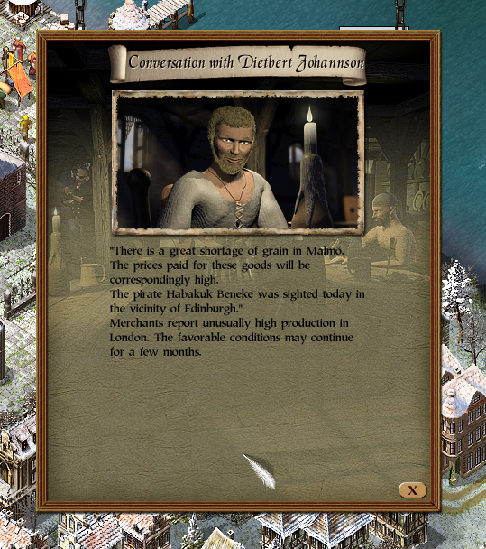
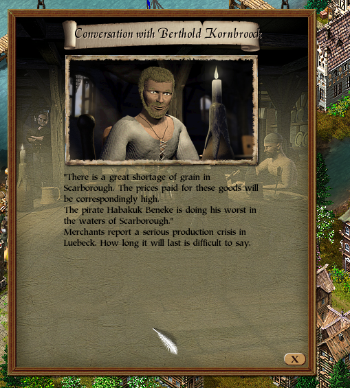

# Real Events for Patrician III

**Version:** 0.1.0  
**Status:** first public release candidate

Real Events adds dynamic economic events to *Patrician III*. Cities can temporarily experience production crises or production booms. These events affect both city production and privately owned businesses, and tavern Informers can reveal rumours about active events.

## What v0.1.0 does

- Keeps between 1 and 5 event cities active over time.
- Adds two event types:
  - **Production crisis:** production falls to roughly 40–60%.
  - **Production boom:** production rises to roughly 140–160%.
- Events last between 1 and 12 in-game months, currently treated as 30 days per month.
- New-event evaluations happen every 30–90 in-game days.
- Events are persisted per campaign in a sidecar `.dat` file.
- Tavern Informers may append one Real Events rumour to their normal vanilla rumours.
- The mod modifies production temporarily during the game's production routines and restores the original facility efficiency immediately afterwards.

## Requirements

Real Events is designed for the GOG release of *Patrician III* and the 32-bit executable used by the P3Modding modloader.

The P3Modding modloader documentation describes the standard layout:

1. Place `p3_modloader.dll` and `Patrician3_modloader.exe` in the Patrician III folder.
2. Create a `mods` folder.
3. Place mod DLLs inside `mods`.
4. Launch `Patrician3_modloader.exe`.

Reference: https://p3modding.github.io/modloader.html

Other game executable builds may work, but v0.1.0 has only been validated against the GOG version.

## Installation

The public package will contain `RealEvents.dll`.

Copy it to:

```text
Patrician III/
└── mods/
    └── RealEvents.dll
```

Then start the game with `Patrician3_modloader.exe`.

## Save data

Real Events stores its own state beside the DLL using a campaign-specific filename:

```text
RealEvents_<campaign-hash>.dat
```

This does not modify the Patrician III save file format.

## Informer rumours

When an economic event is active, an Informer can add one extra rumour after the normal game rumours.

Example crisis:

```text
Merchants report a severe production crisis in Hamburg.
The situation is expected to last for quite some time.
```

Example boom:

```text
Merchants report a strong production boom in Bremen.
The favorable conditions may continue for a few months.
```

The mod deliberately adds to the vanilla text rather than replacing it.

## Debug builds

Development hotkeys are disabled in normal public builds.

To compile a development build, set:

```cpp
#define REAL_EVENTS_DEBUG_TOOLS 1
```

Development-only controls:

- `F10`: add 100,000 money.
- `F11`: cycle Lübeck through CRISIS -> BOOM -> OFF.
- `º` / OEM key: show the internal debug window.

These are testing tools and are not intended for the normal release DLL.

## Compatibility

v0.1.0 currently relies on confirmed addresses and instruction sequences from the tested GOG *Patrician III* executable used with the P3Modding modloader. Other executable versions may require separate validation.

The hook installer checks expected bytes before installing hooks. If a target sequence does not match, that hook is not installed.

## Current limitations

- Only production crisis and production boom events exist.
- Event text is currently English.
- A month is approximated as 30 in-game days for event duration.
- Event tuning is compiled into the DLL in v0.1.0; an external `RealEvents.ini` is planned after the first stable public build.
- Compatibility with every Patrician III language/executable build has not yet been established.

## Documentation

Technical reverse-engineering notes are in `docs/`.

Important distinction used throughout the documentation:

- **Upstream:** information already documented by P3Modding or existing community material.
- **Confirmed by Real Events:** verified by our own runtime testing.
- **Observed:** reproducible observation whose full semantics are not yet known.
- **Hypothesis:** working theory that still requires confirmation.

## Screenshots

| Production crisis | Production boom |
| --- | --- |
|  |  |

## Credits and prior work

Real Events builds on public Patrician III reverse-engineering work, especially:

- P3Modding / Patrician 3 Insights: https://p3modding.github.io/
- P3Modding `p3_ida_scripts`: https://github.com/P3Modding/p3_ida_scripts
- P3Modding `p3-lib`: https://github.com/P3Modding/p3-lib
- Community Cheat Engine research used for several data-layout references.

See `THIRD_PARTY.md` for attribution notes.

## License

Licensed under the Apache License, Version 2.0. See `LICENSE`.
